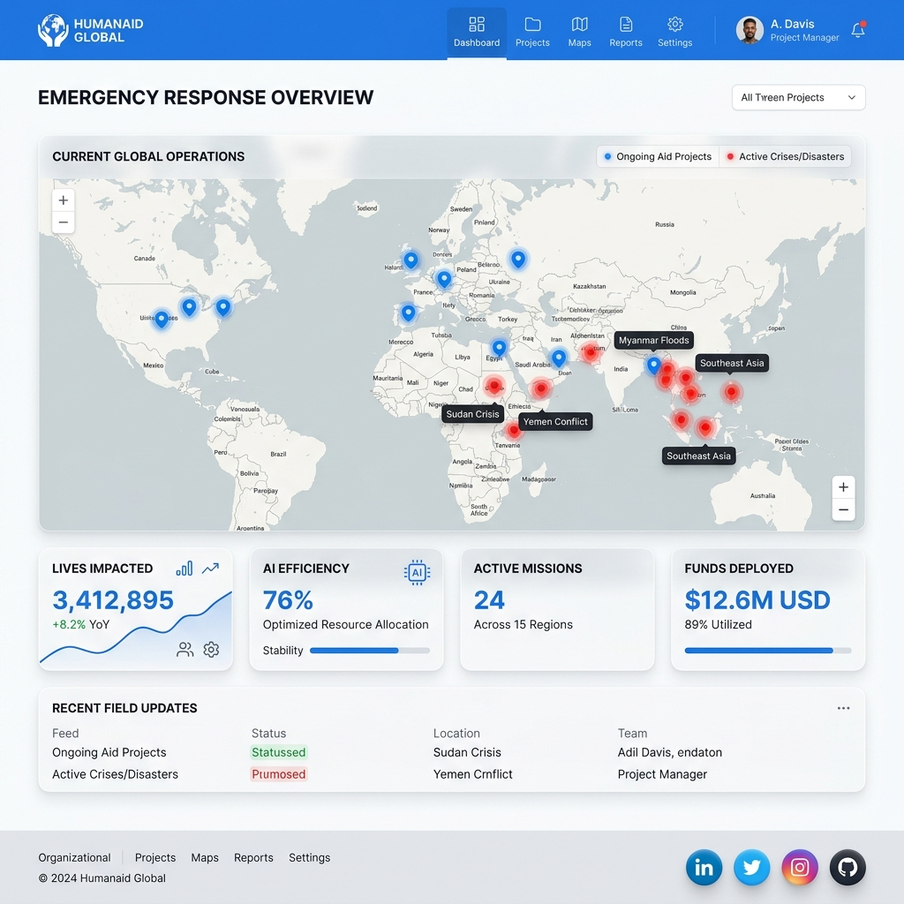

# 🛡️ Smart Resource Allocator: AI-Driven Humanitarian Resilience



A high-fidelity, professional-grade mission control dashboard for NGOs to manage community needs, volunteer matching, and crisis forecasting. Built for **speed, privacy, and field resilience**.

[](https://jaswanthhanumanthu-smart-resource-allocation-ai-build-web-app.streamlit.app/)

[](https://ai.google.dev/)
[](https://github.com/JaswanthHanumanthu/Smart-Resource-Allocation#%EF%B8%8F-ethical-ai-usage--data-privacy)

---

## 🌟 Key Pillars

### 1. 📂 Zero-Friction Digitization (Multimodal AI)
Erase the bottleneck of manual data entry. Field teams can upload **handwritten paper surveys, voice memos, or situational photos**. Our **Gemini 1.5 Flash** pipeline automatically:
*   **Transcribes** audio reports into structured data.
*   **Digitizes** messy field notes and paper forms.
*   **Analyzes** photographs to estimate severity and human impact.

### 2. 📡 Field-First Resilience (PWA & Offline)
Designed for crisis zones with intermittent connectivity.
*   **Offline Queue**: Reports are captured locally and synced automatically when a connection is restored.
*   **PWA Support**: Install the dashboard on mobile devices for native-like performance in the field.
*   **Lightweight UI**: Bento-Grid Glassmorphism interface optimized for sub-1.5s situational updates.

### 3. ⚖️ Ethical AI & Privacy-First
*   **PII Redaction**: Automatic scrubbing of names, phone numbers, and IDs before any data is stored.
*   **Human-In-The-Loop**: All AI-extracted reports go through a **Secure Admin Portal** for manual verification.
*   **Fairness Auditing**: Real-time parity scores to ensure resources are allocated without bias across different demographics and sectors.

---

## 🏆 Why We Win

✅ **Speed**: AI extracts data from handwritten surveys in <5 seconds

✅ **Fairness**: Built-in bias detection & equity auditing

✅ **Resilience**: Works offline in crisis zones (PWA)

✅ **Transparency**: Every match decision is explainable

✅ **Impact**: Predictive models prevent crises before they happen

---

## 🛠️ Technical Stack

*   **Frontend/App**: [Streamlit](https://streamlit.io/) (Python)
*   **AI Backend**: [Google Gemini 1.5 Flash](https://ai.google.dev/)
*   **Visualization**: [Folium](https://python-visualization.github.io/folium/), [Plotly](https://plotly.com/), [Lucide](https://lucide.dev/)
*   **Data Science**: [Pandas](https://pandas.pydata.org/), [Pydantic](https://docs.pydantic.dev/)
*   **Deployment**: PWA (Service Worker + Manifest)

---

## 🚦 Quick Start

### 1. Prerequisites
*   Python 3.10+
*   [Google AI Studio API Key](https://aistudio.google.com/)

### 2. Setup Environment
Clone the repository and create a `.env` file:
```bash
git clone https://github.com/JaswanthHanumanthu/Smart-Resource-Allocation.git
cd Smart-Resource-Allocation
cp .env.example .env
```
Add your Gemini API key to `.env`:
```env
GEMINI_API_KEY=your_gemini_key_here
```

### 3. Installation
```bash
pip install -r requirements.txt
streamlit run app.py
```

---

## 📐 System Architecture

The platform utilizes a multi-modal, privacy-first ingestion and dispatch pipeline:

```mermaid
graph TD
    subgraph "Field Ingestion (Multi-Modal)"
        A[Handwritten Surveys / Messy Notes] --> SCAN[AI Document Scanner (Gemini OCR)]
        B[Field Photos / Scenery] --> IMAGE[Situational Vision Extraction]
        C[Voice Memos / Radio Traffic] --> AUDIO[Audio Analysis & Transcription]
    end
    
    SCAN & IMAGE & AUDIO -->|Structured JSON| TRIAGE[AI Triage & PII Anonymizer]
    TRIAGE -->|Verified Data| CORE[(Mission-Critical Database)]
    
    subgraph "Operational Intelligence"
        CORE --> MAP[Interactive Impact Map & Heatmaps]
        CORE --> INDEX[Executive Urgency Index (Crisis Scoring)]
        CORE --> ANALYTICS[Tactical Fairness & Bias Audit]
    end
    
    subgraph "Tactical Dispatch"
        CORE --> MATCH[Skills-First Matching Engine]
        MATCH -->|Confidence Score + XAI| VOLUNTEER[Volunteer Force Deployment]
    end
```

1.  **RAW_INPUT**: Unstructured field notes (Text/Image/Audio) are ingested via the **Field Report Center**.
2.  **AI_TRIAGE**: Gemini performs PII redaction, situational extraction, and 'Truth Checks'.
3.  **VERIFIED_DATA**: Human administrators authenticate reports before they impact live metrics.

For more technical details, see [ARCHITECTURE.md](ARCHITECTURE.md).

---

## 🚀 Future Roadmap: "What's Next?"

We are committed to evolving this platform from a prototype to a global humanitarian standard. Our vision for the next 12 months includes:

*   🛰️ **Real-time Satellite Integration**: Ingesting high-resolution satellite imagery to automatically detect disaster zones (floods, fires) before reports arrive.
*   📶 **Mesh Network Connectivity**: Enabling field workers to sync data between devices using Bluetooth/LoRa in zero-connectivity environments.
*   🧠 **Gemini 2.0 Integration**: Leveraging next-gen reasoning for complex resource-leveling across entire countries.
*   📱 **Native iOS/Android App**: A dedicated mobile client with full biometric security for rescuers.

---

## 🤝 Contributing
We welcome contributions to help build more resilient communities. Please see our contribution guidelines for how to get involved.

## 📄 License
This project is licensed under the MIT License - see the [LICENSE](LICENSE) file for details.

---
*Built with ❤️ for Humanitarian Impact • Production Prototype v2.0*
